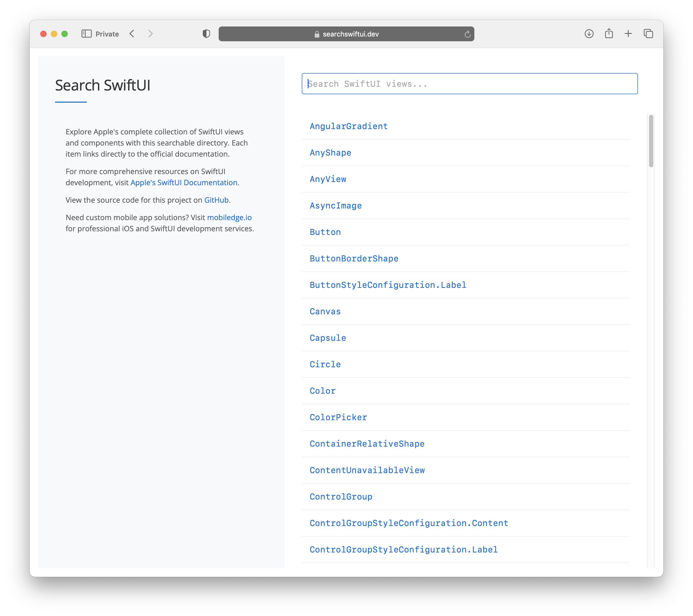

# Search SwiftUI

A searchable web-based directory of SwiftUI views with direct links to Apple's official documentation.

## 🔍 Features

- **Comprehensive List**: Contains all standard SwiftUI views and components
- **Real-time Search**: Instantly filter SwiftUI components as you type
- **Direct Documentation Links**: One-click access to Apple's official documentation
- **Mobile-Friendly**: Responsive design that works on all device sizes
- **Lightweight**: Fast loading with minimal dependencies

## 🚀 Demo

Visit the live site: https://searchswiftui.dev



## 💻 Usage

1. Visit the website
2. Type in the search box to filter views
3. Click on any view to open its official documentation

## 🛠️ Development

This project is built with pure HTML, CSS, and JavaScript. No frameworks or build tools required.

### Prerequisites

- A modern web browser
- Basic knowledge of HTML/CSS/JavaScript (for development)

### Local Setup

1. Clone the repository:
```bash
git clone https://github.com/mobiledge/search-swiftui.git
cd search-swiftui
```

2. Open `index.html` in your browser or use a local server:
```bash
# If you have Python installed
python -m http.server 8000
# Then open http://localhost:8000 in your browser
```

## 📊 Data Source

The SwiftUI views data is sourced from a TSV file hosted at:
```
https://gist.githubusercontent.com/mobiledge/18d10e8ec3e5c93ee6fec58c37cf761b/raw/0e28ae855b2fe424252f517dce069b452e1ba5f5/swiftui-views.tsv
```

This file contains the view names and their documentation paths on developer.apple.com.

## 🔄 Updating the Data

To update the list of SwiftUI views:

1. Edit the TSV file with new entries
2. Ensure the format remains: `ViewName\tDocumentationPath`
3. Host the updated file or update the URL in the JavaScript fetch call

## 📱 About MobileEdge

Need custom iOS app development? Visit [mobiledge.io](https://mobiledge.io) for professional SwiftUI and iOS development services.

## 📄 License

This project is licensed under the MIT License - see the [LICENSE](LICENSE) file for details.

## 🤝 Contributing

Contributions are welcome! Please feel free to submit a Pull Request.

1. Fork the repository
2. Create your feature branch (`git checkout -b feature/amazing-feature`)
3. Commit your changes (`git commit -m 'Add some amazing feature'`)
4. Push to the branch (`git push origin feature/amazing-feature`)
5. Open a Pull Request

## 📞 Contact

Questions or feedback? Open an issue or reach out through [mobiledge.io](https://mobiledge.io/contact).
